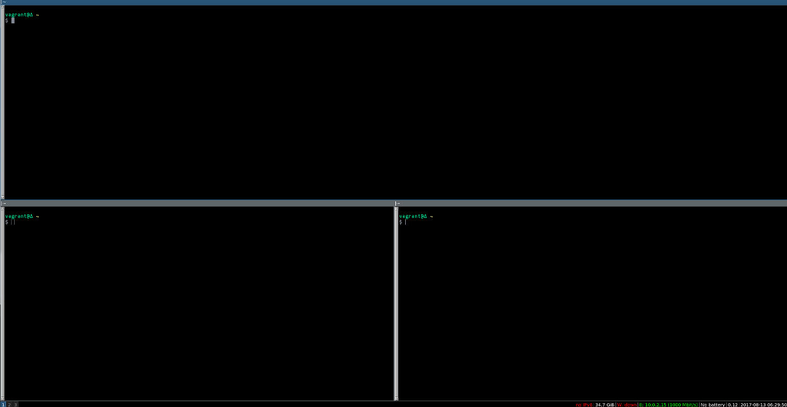
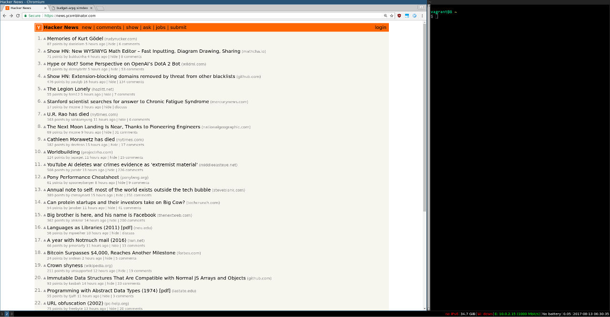
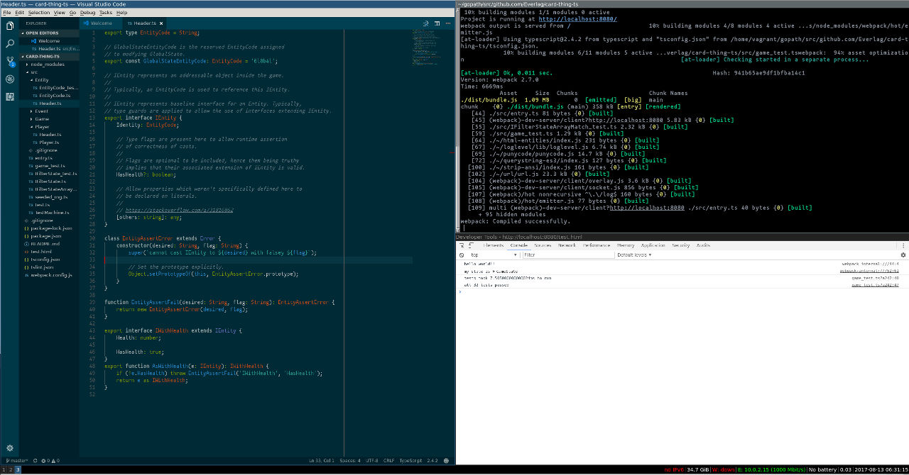

# home

Top level directory is portable dotfiles.

`workspace/` contains a Vagrantfile which will build an i3
based workspace. `vagrant up` to get a replica of my environment.

The workspace should look something like this on first-boot

